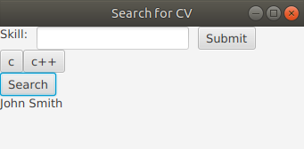

M1IF01 - TP Remise en route JAVA
================================

Objectif
--------

Il vous est demandé de mettre en place quelques classes pour vous
remettre en tête les grands principes de la programmation orientée
objet : messages et collaboration entre objets, attributs et méthodes,
constructeurs, héritage, etc. Pour cela, vous manipulerez un outil de
sélection de CV pour trier des candidatures à une offre d'emploi.

Votre travail servira de base aux TPs suivants qui feront l'objet d'une
note globale.
Le travail se fait de préférence en binômes. Vous pouvez aussi
travailler seul, mais vous n'aurez pas de bonus sur la note.

Environnement
-------------

Pour développer en Java durant le TP, vous pouvez choisir d'utiliser :

-   Un environnement de développement intégré (comme Eclipse, 
    Netbeans ou IntelliJ IDEA) qui permet de compiler, de générer un
    projet, de débugger et d'exécuter.
-   N'importe quel éditeur de texte avec coloration syntaxique, et
    effectuer la compilation et l'exécution en ligne de commande.

Vous pouvez travailler au choix sous Linux ou sous Windows.

## Sur les machines du Nautibus sous Linux

Sur les machines du Nautibus, les TPs ont été testés sous Linux, en
utilisant l'environnement Java installé pour vous dans
`/home/tpetu/m1if01/`.  Avant de démarrer le TP, ajoutez ceci dans
votre fichier `~/.bashrc`:

    PATH=/home/tpetu/m1if01/bin:"$PATH"

Puis rechargez le fichier (`exec bash` par exemple). Vérifiez que vous
obtenez bien :

    $ which java
	/home/tpetu/m1if01/bin/java
    $ which javac
	/home/tpetu/m1if01/bin/javac
    $ which mvn
	/home/tpetu/m1if01/bin/mvn

## Sur les machines du Nautibus sous Windows

Sous Windows, seul Java 8 est installé mais le projet semble marcher
avec cette version. L'outil `mvn` en ligne de commande n'est pas
installé mais vous pourrez faire la majorité des opérations au moins
avec un IDE (Eclipse+m2e et Netbeans sont installés).

## Sur vos machines personnelles

Sur vos machines personnelles, en cas de problème sous Linux, il peut
être nécessaire d'installer JavaFX explicitement (`sudo apt install
openjfx` sous Ubuntu 18.04, ou bien téléchargement depuis
[openjfx.io](https://openjfx.io)). Le TP a été testé avec Java 11, il
ne marchera probablement pas sans adaptation avec d'autres versions.

Si vous avez installé JavaFX via votre distribution et que Java ne
trouve pas les classes JavaFX, ajoutez explicitement les fichiers JAR
concernés à votre classpath, avec quelque chose comme :

    CLASSPATH="$CLASSPATH":/usr/share/java/openjfx/jre/lib/ext/jfxrt.jar
    CLASSPATH="$CLASSPATH":/usr/share/java/openjfx/jre/lib/jfxswt.jar
    export CLASSPATH

Sur machines personnelles, vérifiez que vous avez bien `git` et `mvn`
installés :

```
$ git --version
git version 2.17.0
$ mvn --version
Apache Maven 3.5.2
[...]
```

Si ce n'est pas le cas installez-les. Sous Ubuntu, faire :

```
apt install git maven
```

Création d'un projet sur la forge et récupération du code
---------------------------------------------------------

Ouvrez dans votre navigateur
[forge.univ-lyon1.fr](http://forge.univ-lyon1.fr). Si vous vous
connectez pour la première fois, le système vous permettra de
vérifier/modifier les informations qui vous concernent, idem pour
votre éventuel binôme. Ajoutez ce dernier comme développeur de votre
projet (Configuration → Membres).

Nous allons utiliser le dépôt Git du cours comme base pour votre
projet. Ouvrez la page
[https://forge.univ-lyon1.fr/matthieu.moy/m1if01-2019](https://forge.univ-lyon1.fr/matthieu.moy/m1if01-2019),
et cliquez sur le bouton « fork ». Ce bouton vous permet de récupérer
une copie du projet sur votre espace de la forge.

**IMPORTANT**: pour l'instant, le fork de votre projet est public sur
la forge. Nous vous demandons **impérativement de passer ce projet en
« privé »** pour que vos collègues ne puissent pas recopier votre code.
En cas de copie, nous sanctionnerons sévèrement les étudiants ayant copié **et**
ceux ayant laissé copier leur code. Pour rendre votre projet privé,
rendez-vous dans « settings → general » en bas de la barre latérale de
gauche, puis « Permissions ». Le premier réglage est « Project
visibility ». Dans le menu, choisissez « private », puis cliquez sur
le bouton « save changes ».

Pour vérifier que votre projet est bien privé (indispensable),
retournez à la page d'accueil de votre projet
(`https://forge.univ-lyon1.fr/votre.nom/m1if01-2019`) et copiez l'URL.
Ouvrez une fenêtre de navigation privée
(<kbd>Control</kbd>+<kbd>Shift</kbd>+<kbd>P</kbd> sous Firefox,
<kbd>Control</kbd>+<kbd>Shift</kbd>+<kbd>N</kbd> sous Chrom{e,ium}), et collez l'URL de votre projet
dans la barre d'URL. Comme le projet est privé, vous devez avoir le
message « You need to sign in or sign up before continuing. ». Si ce
n'est pas le cas, vous avez raté quelque chose, recommencez la
manipulation.

Pour vos projets futurs, vous pourrez aussi créer des projets à partir
de zéro. Pour cela, vous pourrez faire simplement « new project »
(bouton **+** en haut de l'écran).

Récupérez une copie locale du code avec la commande (l'URL est à
ajuster et vous est donnée par la forge quand vous ouvrez votre projet
avec votre navigateur) :

```
git clone https://forge.univ-lyon1.fr/votre.nom/m1if01-2019.git
cd m1if01-2019
```

[En cas de problème, voir la faq de la forge](https://forge.univ-lyon1.fr/EMMANUEL.COQUERY/forge/wikis/FAQ).

Premier contact avec le projet
------------------------------

On vous fournit un squelette [cv-search/](../cv-search/). Si ce n'est
pas encore fait, faites un `git clone` de l'ensemble des supports du
cours, et retrouvez ce répertoire (`cv-search`) dans votre
clone.

Le projet utilise l'outil Maven pour la compilation. Nous en parlerons
plus en détails en CM, pour l'instant vous devez seulement savoir :

- Le projet est décrit dans le fichier `pom.xml`. Vous pouvez regarder
  le contenu de ce fichier mais vous n'avez pas besoin de le modifier
  pour ce TP.
  
- `mvn compile` compile le projet

- `mvn exec:java` lance le programme compilé

Vérifiez que vous pouvez lancer le programme depuis la ligne de
commande.

Le squelette contient ces classes :

-   `view.JfxView` : une classe gérant l'interface graphique de
    sélection des critères pour sélectionner les CV dans une base de CV.

-   Des classes `model.Applicant*` : pour gérer pour vous la base de
    CV. Un CV est un fichier `.yaml` (on vous fournit deux exemples
    [`applicant1.yaml`](../cv-search/applicant1.yaml) et
    [`applicant2.yaml`](../cv-search/applicant2.yaml)). Chaque CV
    peut-être chargé dans la classe `Applicant`, et la liste des CV
    disponibles sera gérée par la classe `ApplicantList`.

-   `App` : la principale, qui gère la création de l'application

Le squelette de code fait une première séparation entre l'interface
graphique (package `view`) et la logique métier (package `model`).
Nous verrons plus tard que cette séparation est encore plus
qu'imparfaite et vous demanderons de refactorer le code.

### Exemple d'utilisation

Lancez l'interface graphique, et ouvrez les deux fichiers
`applicant*.yaml`. Mettons-nous dans la peau d'un recruteur qui
cherche un candidat ayant des compétences en C et en C++.

Entrez la chaîne `c` dans le champ texte, puis soumettez. La
compétence `c` est ajoutée à la liste des compétences recherchée.
Faites de même avec `c++`.

Cliquez maintenant sur « search » : la liste des candidats trouvée par
le système est affichée en bas de la fenêtre :



Par défaut, le système sélectionne tous les candidats ayant un niveau
de compétence supérieur à 50 pour toutes les compétences recherchées.
Dans notre cas, `John Smith` correspond car son CV (`applicant1.yaml`)
contient :

```
name: John Smith
skills:
  c: 90
  c++: 70
  java: 50
```

Ce qu'il faut lire comme « Le nom du candidat est John Smith, son
niveau en C est évalué à 90/100, en C++ 70/100 et en Java 50/100 ».

Par contre, le second CV n'est pas sélectionné, car `applicant2.yaml`
montre un niveau de compétences en C de 40, donc <50.

Cliquez maintenant sur `c` dans la liste des compétences requises.
L'entrée `c` disparaît de la liste. Relancez la recherche : `Foo Bar`
doit maintenant apparaître.

### Documentation

Consultez la documentation de [Java
11](https://docs.oracle.com/en/java/javase/11/docs/api/index.html) et de
[JavaFX Graphics](https://openjfx.io/javadoc/11/)
(la bibliothèque graphique utilisée).

### Chargement du projet dans Eclipse, IntelliJ ou Netbeans

Si vous souhaitez utiliser un IDE, votre IDE favori propose
probablement une prise en charge de Maven, et configurera donc le
projet automatiquement depuis le `pom.xml` :

* Eclipse : installer le plugin [m2e](http://www.eclipse.org/m2e/),
  puis importer le projet en temps que projet Maven (File → Import...
  → Maven → Existing Maven Projects). Au nautibus, Eclipse est
  installé dans `/home/tpetu/m1if01/bin/eclipse` avec m2e installé.

* IntelliJ et Netbeans : le support de Maven est inclus de base dans l'outil. Il
  suffit d'ouvrir le répertoire contenant le `pom.xml`.

### Problèmes et solutions fréquents avec Eclipse

Il est possible qu'Eclipse signale une erreur ou un warning de
restriction d'accès lors de l'utilisation de javafx. Ce problème peut
être résolu en [modifiant les propriétés du projet pour autoriser
javafx](http://stackoverflow.com/questions/22812488/using-javafx-in-jre-8).
En résumé : clic droit sur le projet dans le project / package
explorer > Properties > Section Java Build Path > Onglet Libraries >
Selectionner Access Rules > Cliquer sur le bouton Edit > Cliquer sur
le bouton Add > Changer l'option "Forbbiden" en "Accessible" et
saisir `javafx/**` comme Rule pattern.

Si vous obtenez le message

> Error: JavaFX runtime components are missing, and are required to
> run this application

La solution se trouve ici : [https://stackoverflow.com/q/57159440/4830165](https://stackoverflow.com/q/57159440/4830165).

Travail demandé
---------------

Dans un premier temps, conservez l'architecture (répartition en
classes et packages) fournie. Nous verrons bientôt comment réorganiser
le tout.

### Stratégie de sélection

Pour l'instant, nous sélectionnons les candidats ayant toutes les
compétences requises avec un niveau supérieur à 50. Ce n'est pas
toujours une bonne stratégie (et parfois ça ne renvoie aucun
résultat).

Modifiez la classe `JfxView` pour ajouter un choix de stratégie de
sélection du candidat. Ajoutez une stratégie « tout >= 60% », qui
fonctionne sur le même principe que la stratégie par défaut, en étant
plus exigent et en ne sélectionnant que les candidats ayant un
niveau >60 dans toutes les compétences. Ajoutez également une stratégie
« moyenne >= 50% » sélectionnant les candidats ayant un niveau de
compétence moyen sur les compétences requises >50. L'interface peut
ressembler à ceci:
  
  

Il est suggéré d'utiliser la classe
[ComboBox](https://openjfx.io/javadoc/11/javafx.controls/javafx/scene/control/ComboBox.html)
(voir un [tutorial](https://docs.oracle.com/javafx/2/ui_controls/combo-box.htm)).

Testez.

### Tri des candidats

Ajoutez une fonctionnalité permettant de trier les candidats selon la
moyenne des compétences recherchées, le premier étant le candidat
ayant la meilleure moyenne.

### Problèmes avec la base de code fournie

Réfléchissez maintenant à l'architecture du code. Posez-vous les
questions suivantes :

* Est-ce facile de modifier l'interface graphique sans changer la
  fonctionnalité ?
  
* &Agrave; l'inverse, des modifications sur l'algorithme de sélection des
  candidats devraient être indépendantes, ou presque, de l'interface
  graphique utilisée. Par exemple, quand vous avez ajouté la stratégie
  « moyenne >= 50% », vous avez bien sûr dû ajouter une entrée au
  `ComboBox` permettant de choisir la stratégie, mais avez-vous réussi
  à faire le reste du travail sans toucher à JavaFX ?
  
* Si vous deviez avoir plusieurs interfaces possibles (par exemple un
  mode « expert » et un mode « débutant » avec moins de boutons, ou
  une interface web et une interface graphique JavaFX), pourriez-vous
  le faire facilement ?
  
* Quelles sont les responsabilités de la classe `JfxView` ? Est-ce
  compatible avec le [Principe de Responsabilité
  Unique](https://en.wikipedia.org/wiki/Single_responsibility_principle) ?

Quelques éléments de réponses sont disponibles dans le fichier
[architecture-et-dependances.md](architecture-et-dependances.md). Ne
les lisez pas avant d'y avoir réfléchi vous-mêmes.

Si vous avez fini ...
---------------------

Passez au [lab2](../lab2-tools) !
